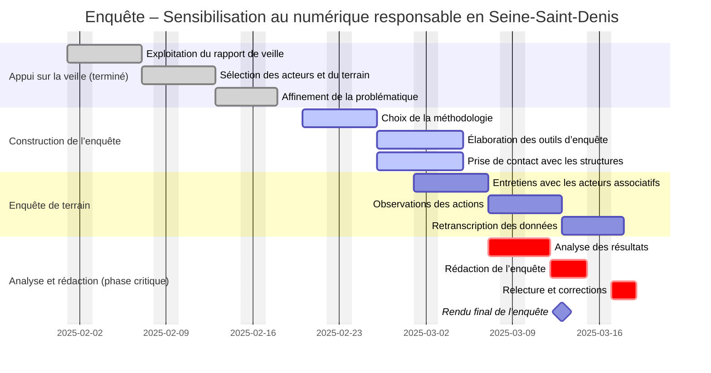

```mermaid
gantt
    dateFormat  YYYY-MM-DD
    title       Enquête – Sensibilisation au numérique responsable en Seine-Saint-Denis
    excludes    weekends

    section Appui sur la veille (terminé)
    Exploitation du rapport de veille          :done,    t1, 2025-02-01, 5d
    Sélection des acteurs et du terrain        :done,    t2, after t1, 4d
    Affinement de la problématique             :done,    t3, after t2, 3d

    section Construction de l’enquête
    Choix de la méthodologie                   :active,  t4, 2025-02-20, 4d
    Élaboration des outils d’enquête           :active,  t5, after t4, 5d
    Prise de contact avec les structures       :active,  t6, after t4, 5d

    section Enquête de terrain
    Entretiens avec les acteurs associatifs    :         t7, 2025-03-01, 5d
    Observations des actions                   :         t8, after t7, 4d
    Retranscription des données                :         t9, after t8, 3d

    section Analyse et rédaction (phase critique)
    Analyse des résultats                      :crit,    t10, 2025-03-07, 3d
    Rédaction de l’enquête                     :crit,    t11, after t10, 3d
    Relecture et corrections                   :crit,    t12, after t11, 2d
    Rendu final de l’enquête                   :milestone, rendu, 2025-03-13, 0d

```
